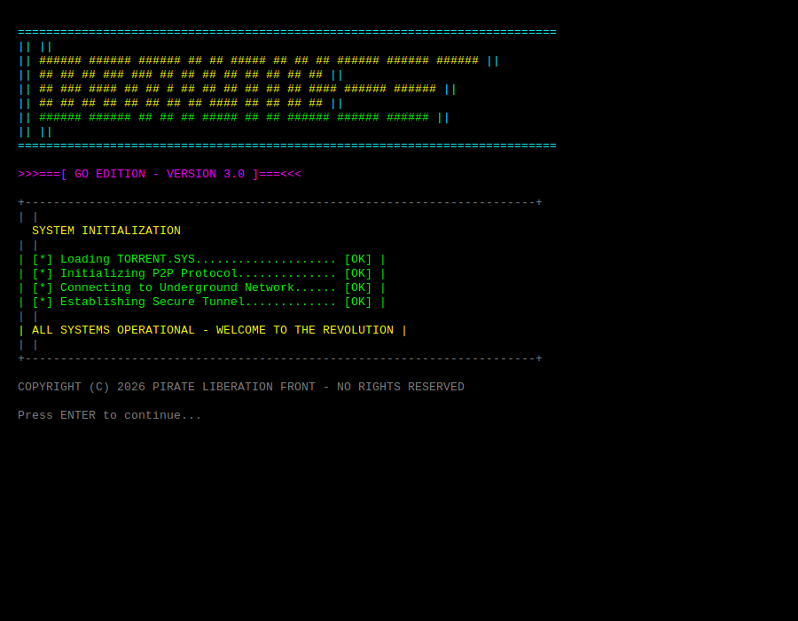
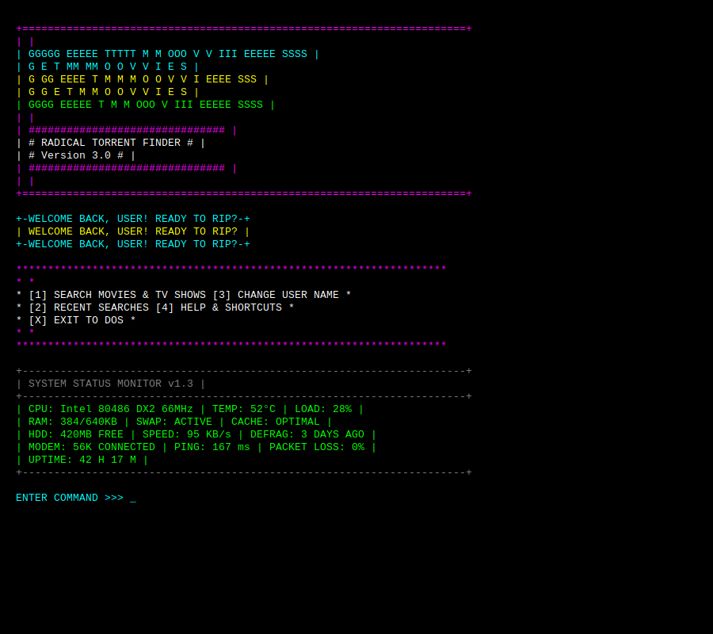
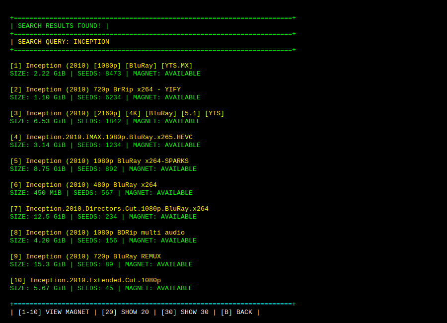
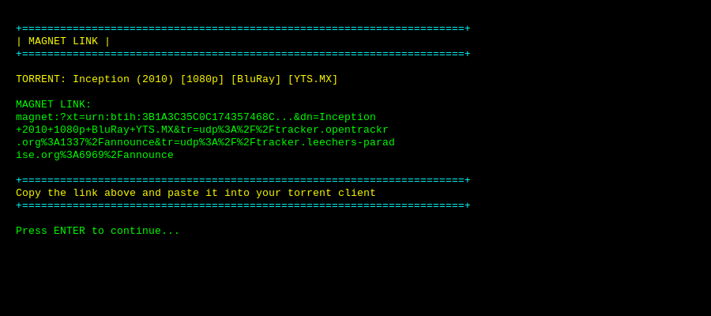
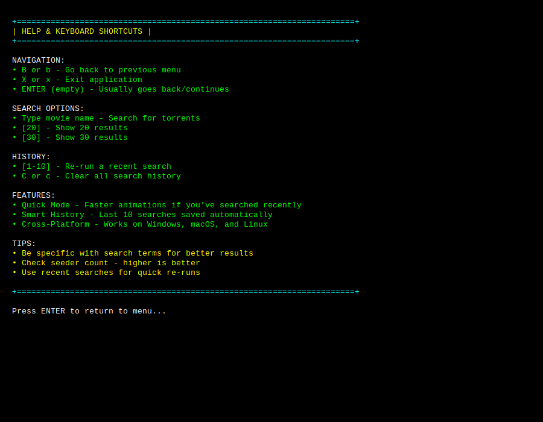

# GetMovies 3.0 - Go Edition

<div align="center">

```
    ============================================================================
    ||                                                                        ||
    ||  ######  ###### ###### ##   ##  #####  ##  ## ## ###### ###### ######  ||
    ||  ##      ##       ##   ### ### ##   ## ##  ## ## ##     ##     ##      ||
    ||  ## ###  ####     ##   ## # ## ##   ## ##  ## ## ####   ###### ######  ||
    ||  ##  ##  ##       ##   ##   ## ##   ##  ####  ## ##         ##     ##  ||
    ||  ######  ######   ##   ##   ##  #####    ##   ## ###### ###### ######  ||
    ||                                                                        ||
    ============================================================================

                    >>>===[ GO EDITION - VERSION 3.0 ]===<<<
```

**A retro-styled command-line torrent search application**

[](https://go.dev/)
[](LICENSE)
[](README.md)

</div>

---

## 📖 Table of Contents

- [Overview](#overview)
- [Features](#features)
- [Screenshots](#screenshots)
- [Installation](#installation)
- [Usage](#usage)
- [Building from Source](#building-from-source)
- [Project History](#project-history)
- [Architecture](#architecture)
- [Contributing](#contributing)
- [License](#license)

---

## 🎯 Overview

GetMovies is a **cross-platform command-line application** that provides a clean, ad-free interface for searching torrents on The Pirate Bay. Built with Go, it combines practical functionality with a nostalgic 1980s BBS aesthetic, delivering an experience that's both useful and fun.

### Why GetMovies?

Have you ever tried to search for a movie on The Pirate Bay through a browser? It's a nightmare of:
- 🚫 Popup windows
- 🚫 Fake download buttons
- 🚫 Sketchy redirects
- 🚫 Malware risks
- 🚫 Endless ads

**GetMovies solves these problems:**
- ✅ No browser required
- ✅ No popups or ads
- ✅ Clean terminal interface
- ✅ Direct magnet links
- ✅ Fast and lightweight
- ✅ Cross-platform (Windows, macOS, Linux)

### Design Philosophy

GetMovies isn't just a torrent search tool—it's a **love letter to the golden age of computing**. Remember when:
- Computers booted with `AUTOEXEC.BAT`
- BBS systems ruled the underground
- ANSI art was the height of graphics technology
- 2400 baud modems were cutting edge

This tool brings that aesthetic back while delivering modern functionality.

---

## ✨ Features

### Core Functionality

- 🔍 **Torrent Search** - Search The Pirate Bay directly from your terminal
- 🧲 **Magnet Links** - View and copy magnet links for any result
- 📊 **Result Details** - See file sizes, seeder counts, and availability
- 🚀 **Quick Mode** - Faster animations for repeat users (searches within 60 minutes)
- 📜 **Search History** - Automatically saves your last 10 searches with timestamps
- 🎨 **Retro Aesthetic** - Beautiful 1980s BBS-style interface with color

### User Experience

- ⚡ **Adaptive Performance** - Quick mode reduces loading animations from 6 seconds to <1 second
- 🕐 **Smart Timestamps** - Shows "5 minutes ago" instead of exact times for recent searches
- 🛡️ **Safety Confirmations** - Prompts before destructive actions (clearing history)
- ❓ **Built-in Help** - Comprehensive keyboard shortcuts and feature documentation
- 🔄 **Re-run Searches** - Quickly re-execute previous searches from history

### Technical Features

- 📦 **Single Binary** - No dependencies, no runtime required
- 🌐 **Cross-Platform** - Identical experience on Windows, macOS, and Linux
- ⏱️ **Configurable Timeout** - 30-minute connection timeout for slow networks
- 💾 **Simple Storage** - Plain text files for configuration and history
- 🎨 **Cross-Platform Colors** - Automatic terminal color detection with fallback

---

## 📸 Screenshots

### Splash Screen



### Main Menu



### Search Results



### Magnet Link Display



### Help & Shortcuts



---

### Text Version (for reference)

<details>
<summary>Click to expand text versions</summary>

**Splash Screen:**
```
    ============================================================================
    ||                                                                        ||
    ||  ######  ###### ###### ##   ##  #####  ##  ## ## ###### ###### ######  ||
    ||  ##      ##       ##   ### ### ##   ## ##  ## ## ##     ##     ##      ||
    ||  ## ###  ####     ##   ## # ## ##   ## ##  ## ## ####   ###### ######  ||
    ||  ##  ##  ##       ##   ##   ## ##   ##  ####  ## ##         ##     ##  ||
    ||  ######  ######   ##   ##   ##  #####    ##   ## ###### ###### ######  ||
    ||                                                                        ||
    ============================================================================

                        >>>===[ GO EDITION - VERSION 3.0 ]===<<<

    +------------------------------------------------------------------------+
    |                                                                        |
    |                        SYSTEM INITIALIZATION                           |
    |                                                                        |
    | [*] Loading TORRENT.SYS.................... [OK]                       |
    | [*] Initializing P2P Protocol.............. [OK]                       |
    | [*] Connecting to Underground Network...... [OK]                       |
    | [*] Establishing Secure Tunnel............. [OK]                       |
    |                                                                        |
    |      ALL SYSTEMS OPERATIONAL - WELCOME TO THE REVOLUTION               |
    |                                                                        |
    +------------------------------------------------------------------------+

           COPYRIGHT (C) 2026 PIRATE LIBERATION FRONT - NO RIGHTS RESERVED

    Press ENTER to continue...
```

**Main Menu:**
```
    (See above image)
```

**Search Results:**
```
    (See above image)
```

**Magnet Link:**
```
    (See above image)
```

</details>

---

## 🚀 Installation

### Option 1: Download Pre-built Binary (Recommended)

**Coming Soon**: Pre-built binaries will be available in [GitHub Releases](../../releases).

Choose your platform:
- `getmovies-windows-amd64.exe` - Windows 64-bit
- `getmovies-macos-arm64` - Apple Silicon Macs (M1/M2/M3)
- `getmovies-macos-amd64` - Intel Macs
- `getmovies-linux-amd64` - Linux 64-bit

**Windows:**
1. Download `getmovies-windows-amd64.exe`
2. Double-click to run, or run from Command Prompt

**macOS:**
```bash
# Download binary
curl -LO https://github.com/markbreen/GetMovies/releases/download/v3.0/getmovies-macos-arm64

# Make executable
chmod +x getmovies-macos-arm64

# Run
./getmovies-macos-arm64
```

**Linux:**
```bash
# Download binary
wget https://github.com/markbreen/GetMovies/releases/download/v3.0/getmovies-linux-amd64

# Make executable
chmod +x getmovies-linux-amd64

# Run
./getmovies-linux-amd64
```

### Option 2: Build from Source

See [Building from Source](#building-from-source) below.

---

## 💻 Usage

### Basic Workflow

1. **Launch the application**
   ```bash
   ./getmovies        # Linux/Mac
   getmovies.exe      # Windows
   ```

2. **First-time setup**
   - Enter your name for personalization
   - Your preference is saved to `getmovies_config.txt`

3. **Search for torrents**
   - Select `[1] SEARCH MOVIES & TV SHOWS`
   - Enter a movie or TV show name
   - View results with file sizes and seeder counts

4. **View magnet links**
   - Select a result number (e.g., `1`, `2`, `3`)
   - Copy the magnet link
   - Paste into your torrent client (qBittorrent, Transmission, etc.)

5. **Re-run previous searches**
   - Select `[2] RECENT SEARCHES`
   - Choose from your last 10 searches
   - Searches are saved with timestamps

### Keyboard Shortcuts

| Key | Action |
|-----|--------|
| `1-3` | Navigate main menu options |
| `1-10` | Select search result to view magnet link |
| `20` | Show 20 results (instead of default 10) |
| `30` | Show 30 results |
| `B` or `b` | Go back to previous menu |
| `C` or `c` | Clear search history (with confirmation) |
| `X` or `x` | Exit application |
| `ENTER` | Continue / Go back (context-dependent) |

### Features Explained

#### Quick Mode

GetMovies automatically detects if you've searched recently (within 60 minutes) and enables **Quick Mode**:
- **Normal Mode**: Full loading animations (~6 seconds)
- **Quick Mode**: Minimal animations (<1 second)

This gives you the full "retro experience" on first use, then gets out of your way for efficiency.

#### Smart Timestamps

Search history shows human-friendly timestamps:
- `5 minutes ago` - Recent searches
- `2 hours ago` - Within the last day
- `yesterday` - Previous day
- `01/12 14:30` - Older searches

#### Search History

Your last 10 searches are automatically saved to `recent_searches.txt` with:
- Timestamp of when you searched
- Exact search term used
- Automatic duplicate removal (latest timestamp kept)

---

## 🔧 Building from Source

### Prerequisites

- **Go 1.21 or later** ([Download](https://go.dev/dl/))
- Git (for cloning the repository)

### Clone and Build

```bash
# Clone repository
git clone https://github.com/markbreen/GetMovies.git
cd GetMovies

# Install dependencies
go mod download

# Build for your current platform
go build -o getmovies

# Run
./getmovies
```

### Cross-Compilation

Build for other platforms:

```bash
# Windows (from Mac/Linux)
GOOS=windows GOARCH=amd64 go build -o getmovies-windows-amd64.exe

# macOS Intel (from Windows/Linux)
GOOS=darwin GOARCH=amd64 go build -o getmovies-macos-amd64

# macOS Apple Silicon (from Windows/Linux)
GOOS=darwin GOARCH=arm64 go build -o getmovies-macos-arm64

# Linux (from Mac/Windows)
GOOS=linux GOARCH=amd64 go build -o getmovies-linux-amd64
```

---

## 📚 Project History

GetMovies has evolved through multiple iterations:

### Version 1.0 (PowerShell)
- Original Windows-only version
- Built with PowerShell
- Featured retro BBS aesthetic

### Version 2.0 (PowerShell Enhanced)
- **20 different splash screens** themed after classic computers:
  - Commodore 64, ZX Spectrum, Apple II
  - Amiga Workbench, Norton Commander
  - War Games JOSHUA terminal
  - And 14 more!
- Advanced features: Top downloads, settings, documentation viewer
- Enhanced personalization

### Version 3.0 (Go Edition) - **Current**
- **Complete rewrite in Go** for cross-platform support
- Works identically on Windows, macOS, and Linux
- Single binary distribution (no runtime required)
- Improved UX based on professional design review
- Added magnet link viewing
- Smart timestamps and quick mode
- Modern error handling and user feedback

**What's Different from PowerShell Version?**

| Feature | PowerShell (v2.1) | Go (v3.0) |
|---------|------------------|-----------|
| Platform Support | Windows only | Windows, macOS, Linux |
| Installation | Requires PowerShell | Single binary, no dependencies |
| Splash Screens | 20 different themes | 1 classic BBS theme |
| Magnet Links | None | View and copy links |
| Timestamps | Fake (always current time) | Real timestamps |
| Quick Mode | 10x faster animations | Minimal animations |
| Help System | In-app documentation | Built-in help menu |
| Confirmations | None | Destructive action warnings |

---

## 🏗️ Architecture

### Project Structure

```
getmovies/
├── main.go          # Entry point, main menu loop, orchestration
├── types.go         # Data structures (Torrent, Config, AppState)
├── display.go       # All UI rendering (splash, menus, results)
├── search.go        # HTTP requests and HTML parsing
├── config.go        # User configuration management
├── history.go       # Search history with timestamps
├── go.mod           # Go module definition
└── go.sum           # Dependency checksums
```

### Dependencies

| Package | Purpose |
|---------|---------|
| `github.com/fatih/color` | Cross-platform terminal colors |
| `github.com/PuerkitoBio/goquery` | HTML parsing (jQuery-like API) |
| Standard library | HTTP client, file I/O, time handling |

### Data Storage

GetMovies uses simple text files for all persistence:

**`getmovies_config.txt`** - User configuration
```
username:Kevin
splashscreen:1
```

**`recent_searches.txt`** - Search history (last 10)
```
2026-01-12T14:30:00Z|inception
2026-01-12T10:15:00Z|the matrix
2026-01-11T18:45:00Z|blade runner 2049
```

Files are stored in the current directory for simplicity (matching the original PowerShell version behavior).

---

## 🎨 Design Decisions

### Why Go?

1. **Cross-Platform** - Single codebase, multiple platforms
2. **Static Binaries** - No runtime dependencies, easy distribution
3. **Fast Compilation** - Quick iteration during development
4. **Great Libraries** - Excellent HTTP and HTML parsing support
5. **Terminal Colors** - `fatih/color` provides perfect cross-platform color support

### UX Improvements (v3.0)

Based on a professional UX review, v3.0 implements:

✅ **Fixed menu numbering** (was 1,2,5 - now 1,2,3,4)
✅ **Real timestamps** (not fake "current time" stamps)
✅ **Magnet link functionality** (the core missing feature!)
✅ **Confirmation dialogs** (before clearing history)
✅ **Ultra-fast quick mode** (3 steps instead of 12)
✅ **Built-in help** (keyboard shortcuts and features)
✅ **Better error messages** (user-friendly, not technical)

### Why Plain Text Files?

- **Simplicity** - Easy to understand and debug
- **Portability** - Works everywhere, no database needed
- **Transparency** - Users can view/edit their data
- **Compatibility** - Matches original PowerShell version

### Why One Splash Screen?

The PowerShell version has 20 splash screens (C64, Amiga, ZX Spectrum, etc.). The Go version focuses on:
- **Consistency** - One polished experience
- **Simplicity** - Easier maintenance
- **Speed** - Faster development iteration

Future versions may add more splash screens if there's demand.

---

## 🤝 Contributing

Contributions are welcome! Whether you want to:
- 🐛 Report bugs
- 💡 Suggest features
- 📝 Improve documentation
- 🎨 Add more splash screens
- 🔧 Fix issues

### How to Contribute

1. **Fork the repository**
2. **Create a feature branch** (`git checkout -b feature/amazing-feature`)
3. **Make your changes**
4. **Test thoroughly** on your platform
5. **Commit your changes** (`git commit -m 'Add amazing feature'`)
6. **Push to the branch** (`git push origin feature/amazing-feature`)
7. **Open a Pull Request**

### Development Guidelines

- **Code Style** - Follow standard Go conventions (`gofmt`, `golint`)
- **Testing** - Test on Windows, macOS, and Linux if possible
- **Documentation** - Update README for new features
- **Commits** - Write clear, descriptive commit messages

---

## 📄 License

This project is licensed under the **MIT License** - see the [LICENSE](LICENSE) file for details.

**TL;DR**: You can use, modify, and distribute this code freely. No warranties provided.

---

## 🙏 Acknowledgments

- **The Pirate Bay** - For being the resilient torrent index
- **1980s BBS Culture** - Inspiration for the aesthetic
- **WarGames (1983)** - "Shall we play a game?"
- **fatih/color** - Excellent Go color library
- **PuerkitoBio/goquery** - Making HTML parsing pleasant

---

## 📞 Support

### Having Issues?

1. Check the **[Help Menu]** in the app (`[4] HELP & SHORTCUTS`)
2. Read the **[Usage](#usage)** section above
3. Search existing **[GitHub Issues](../../issues)**
4. Open a new issue with:
   - Your operating system
   - Go version (`go version`)
   - Steps to reproduce the problem
   - Error messages or unexpected behavior

### Feature Requests

Have an idea? [Open an issue](../../issues/new) with the `enhancement` label!

---

## ⚠️ Disclaimer

GetMovies is a **search tool** that helps you find torrent magnet links. It does not:
- Host any content
- Download any files
- Provide torrent client functionality

**You are responsible for**:
- Using a torrent client to download files
- Complying with local laws regarding file sharing
- Respecting copyright and intellectual property

This tool is provided for **educational and personal use only**. The developers are not responsible for how you use it.

---

## 🎯 Roadmap

Potential future features (not committed):

- [ ] **Command-line arguments** - `getmovies "search term"` for power users
- [ ] **More splash screens** - Port classics from v2.0 (C64, Amiga, etc.)
- [ ] **Category filtering** - Movies, TV, music, etc.
- [ ] **Sorting options** - By seeds, date, size
- [ ] **Mirror sites** - Fallback if primary site is down
- [ ] **Config location** - Move to `~/.config/getmovies/` on Linux/Mac
- [ ] **Pagination** - Navigate through more than 30 results
- [ ] **Color customization** - User-defined color schemes

Vote for features by commenting on issues or opening new ones!

---

<div align="center">

**[⬆ Back to Top](#getmovies-30---go-edition)**

---

Made with ❤️ and nostalgia for the golden age of computing

```
                    "THE UNDERGROUND NEVER FORGETS"
```

**© 2026 Pirate Liberation Front - No Rights Reserved**

</div>
